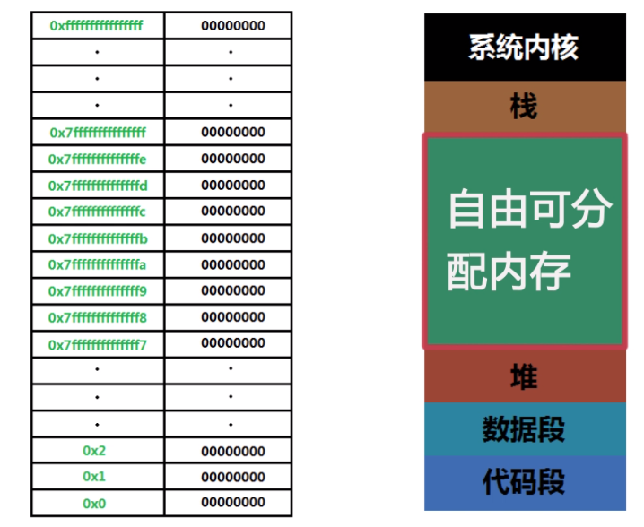

# ClangStudy
Clang Study

### 编译
```
gcc -std=c99 app.c -o app.out
```

### 基础

#### 一些量
```
%4.2f 
常量
#define PI 3.14
```

#### 强制类型转换
```
double num = 2.5;
printf("num %4.2f \n",(int)num);
```

#### 三元表达式
和js的差不多
```
int c = a>b?1:0
```

#### if
```
if (a > 100) {

}else if (a > 50) {

}else {

}
```

#### while
```
    int i = 0;
    int sum = 0;
    while(i<100) {
        i++;
        sum += i;
    }
```

#### do while
```
    int i = 0;
    int sum = 0;
    do {
        i++
        sum += i
    }while(i<100)
```

#### for
```
for (int a=0;a<10;a++) {}
```
#### 臭名远扬的goto
```
    int a = 0;
    ac:
    printf("he");
    if (a < 10) {
        a ++;
        goto ac;
    }
    printf("哈哈哈");
    return 0;
```

### 分别编译
```
现在有两个文件 a.c  b.c
a.c 依赖 b.c中的函数

gcc -std=c99 -c b.c -o b.o   // 先编译b.c
```

### Makefile
```
#this is make file
hello.out:sum.o main.c  # sum.o main.c为 hello.out的依赖
	gcc sum.o main.c -o hello.out  # 具体命令
sum.o:sum.c    # 上面如果有依赖 就会向下面寻找 先编译依赖
	gcc -c sum.c -o sum.o

# 最终的在最上层  依赖依次往下
```

### 关于返回
```
#include 
int main(int argc,char* argc[])
{
    printf("Hello C\n");
    return 101;
}

>>> echo $?   // if $? == 0 这个程序就没有问题

// int argc 为用户输入参数个数
// argc[] 为用于输入参数
```
### 数组pro [array_pro]
```
// 这里传入之后 尽然可以直接修改值
void convert(int a[],int b[])
{
    for(int i=0;i<5;i++) {
        if (a[i] > b[i]) {
            int c = b[i];
            b[i] = a[i];
            a[i] = c;
        }
    }
}

int main(void) {
    int a[] = {1,2,3,4,5};
    int b[] = {5,4,3,2,1};
    convert(a,b);
    for (int i=0;i<5;i++) {
        printf("%d \n",a[i]);
    }
}

// 冒泡排序   
void sort(int a[]) {
    for (int j=4;j>0;j--) {
        for (int i=0;i<j;i++) {
            int temp;
            if (a[i] < a[i + 1]) {
                temp = a[i + 1];
                a[i+1] = a[i];
                a[i] = temp;
            }
        }
    }
}
```
#### 数组字符串
```
    char a[]= "你好世界!";
    char b[6] = {'h','e','l','l','o','\0'};  // \0为结束符
    printf("%s \n",a);
    printf("%s \n",b);

    char s1[] = "a";
    char s2[] = "a";
    char s3[] = "c";

    // 常用字符串函数
    printf("a ASICII: %d \n",'a');
    printf("b ASICII: %d \n",'b');
    printf("s1 len: %d s2 ;en: %d \n",strlen(a),strlen(b));
    printf("s1 eq s2 ?: %d \n",strcmp(s1,s2));
    printf("s1 eq b s3: %d \n",strcmp(s1,s3));  // o eq 反之就是asicii的差值

    // strcpy()  字符串覆盖
    char test1[] = "hello world";
    strcpy(test1,"helo"); // 会把 helo 覆盖到test1中  不能超出啊
    printf("%s \n",test1);

    // strcat() 字符串拼接
    char a1[100]="我是你爸爸 ";
    char b1[] = "Hello World";
    strcat(a1,b1);
    printf("%s \n",a1);
```
### 标准IO
- stdio
- stdout
- stderr
```
fprintf(stdout,"Please input the value a:");
    int a;
    fscanf(stdin,"%d",&a);
    if (a < 0) {
        fprintf(stderr,"the value must > 0\n");
        return -1;
    }

// 通道
./a.out < a.file 1>a.log 2>b.log 
< 标准输入流
1为标准输出流
2标准错误流
```
### 指针
```
void change(int *a,int *b)
{
	int tmp = *a;
	*a = *b;
	*b = tmp;
}

int main()
{
	int a = 5;
	int b = 3;
	change(&a,&b);
	printf("num a=%d\nnum b=%d\n",a,b);
	return 0;
}
```

### gdb工具
`gcc -g main.c -o main.out` -g生成支持调试的

```
Temporary breakpoint 1, main () at c4.c:11
11      {
(gdb) p a
$1 = -8672
(gdb) n
12              int a = 5;
(gdb) p a
$2 = -8672
(gdb) p b
$3 = 32767
(gdb) n
13              int b = 3;
(gdb) n
14              change(&a,&b);
(gdb) l
9
10      int main()
11      {
12              int a = 5;
13              int b = 3;
14              change(&a,&b);
15              printf("num a=%d\nnum b=%d\n",a,b);
16              return 0;
17      }
18
(gdb) 
```
- start // 开始代码
- p s // 查看s的指针
- n   // next
- s   // 进入
- l   // 显示当前代码
- bt  // 打印堆栈
- f 1 // 切换函数栈层级
- q   // 推出调试
- 回车 // 执行上一步的命令

### 指针与内存

```
静态变量
常量
全局变量 都在数据段
```

### 结构体开篇 [day7]
- 编译步骤
```
.c -> .i // 预处理阶段  (1.展开头文件 2.宏替换)
.i -> .s // 编译阶段
.s -> .o // 汇编阶段
.o -> 可执行文件  // 链接阶段
gcc -o helloworld.i helloworld.c -E // 只执行预处理
```
- 宏 s1.c
```
#define R 10 // 定义宏  编译器认为宏就是字符串
#define N(n) n * 10
int main(void) 
{
    int a = R;  // 预处理阶段 会吧10替换到这里
    int c[R];    
    int b = N(a); // int b = a * 10; .i文件替换为
```
- typedef s2.c
```
typedef int tni;
```
- 结构体 struct s3.c
```
typedef struct weapon {
    char name[20];
    int atk;
    int price;
} wp;

wp a;
a.atk = 12;
a.price = 355;
strcpy(a.name,"泥巴吧");
printf("A atk: %d A price: %d A name: %s \n",a.atk,a.price,a.name);

printf("============ \n");
wp b = {"你大爷",12,22};
printf("B atk: %d  price: %d  name: %s \n",b.atk,b.price,b.name);


// 结构体指针
void stP(struct weapon *a) {
    (*a).atk = 12;
    (*a).price = 111;
    strcpy((*a).name,"泥巴吧");
}

void stP2(struct weapon *a) {
    a->atk = 8;
    a->price = 888;
    strcpy(a->name,"泥巴吧11");
}

void test2(void) {
    wp b = {"你大爷",12,22};
    stP(&b);
    printf("B atk: %d  price: %d  name: %s \n",b.atk,b.price,b.name);
    stP2(&b);
    printf("B atk: %d  price: %d  name: %s \n",b.atk,b.price,b.name);
}

// 结构体数组
void test3(void) {
    wp aa[2] = {
        {"你大爷",12,22},
        {"你爸爸",88,82},
    };
    static wp *b;
    b = aa;
    printf("B atk: %d  price: %d  name: %s \n",b->atk,b->price,b->name);
    b++;
    printf("B atk: %d  price: %d  name: %s \n",b->atk,b->price,b->name);
}
```

### 共用体 s4.c (联合体 让几个不同类型的变量共享一个内存地址  but 在统一时刻只能存储一个成员)
```
共用体占的内存长度为 共用体成员中最大的类型长度
结构体占的内存长度为 不是总大小 要涉及内存对齐

union data {
    int a;
    char b;
    int c;
};

int main(void) {
    union data d1;
    d1.a = 11;
    printf("d1 a: %d \n",d1.a); // 11
    d1.c = 12;
    printf("d1 c: %d \n",d1.c); // 12

    printf("d1 a: %d \n",d1.a); // 12

    return 0;
}
```